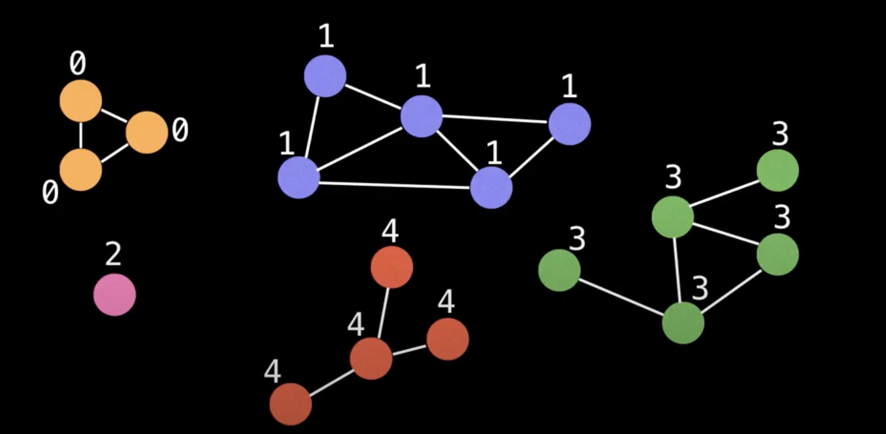

# Graph-Theory

## Introduction: 

 - Graph theory is the mathematcial theory of the properties and applications of graphs (networks)
 
 - Graph can be used to represent any kind of problems. For example, social networks of friends or combination of different items. 
 
 ## Types of Graphs: 
 
 1. Undirected Graph: is graph in which edges have no orientation/directions and can drawn either ways. the edge (u,v) is identical to the edge  (v,u)  
 2. Directed Graph: is a graph in which edges jave ORIENTATION/DIRECTION. For example, the edge (u,v) is the edge from node u to node v.   
 3. Weighted graphs: many graphs can contain certain weight to represent arbitrary value such as cost, distance, quantity, etc. 
 
 ### Special graphs: 

+ Tree: is an undirected graph with no cycles. Equivalently, it is a connected graph with N nodes and N-1 edges. 

+ Rooted Tree: is a tree with a designated root node where every edge either points away from or towards the root node. 

    + Arborescene (out-tree) is when edges point away from the root of the graph
    + Anti-arborescene (in-tree) is when edges point toware the root of the graph 
    
    + Directed Acyclic Graphs (DAGs): are directed graphs with no cycles. These graphs play a vital role in representing structures with dependencies . All out-trees are DAGs but not all DAGs are out-trees

+ Bipartite Graph: is one whose vertices can be split into two independent groups U, V such that every edge connects U and V

+ Complete Graphs: is one where there is a unique edge between every pair of nodes. A complete graph with n vertices is denoted as the graph Kn. 

## Representing Graphs: 

Adjacency matrix: is a very simple way to represent a graph. The idea is that the cell m[i][j] represents the edge weight of going from node i to node j. 

Pros: 
+ Space efficient for representing dense graphs 
+ Edge weight lookup is O(1)
+ Simplest graph representation
    
Cons: 
+ Requires 0(V^2) space
+ Iterating over all edges takes O(V^2) time
 
 
 Adjacency list: is a way to represent a graph as a map from nodes to list of edges. 
```
Example: A -> [(B,4), (C, 1)]
               B ->  [(C, 6)]
               C -> [(A, 4), (B, 1), (D, 2)]
               D -> []
```
Pros: 
+ Space efficient for representing sparse graphs 
+ Iterating over all edges is efficient

Cons:
+ Less space efficient for denser graph. 
+ Edge weight lookup is O(E)
+ Slightly more complex graph representation


Edge list: a way to represent a graph simply as an unordered list of edges. Assume the notation for any triplet (u,v,w) means: "the cost from node u to node v is w". However, this representation is seldomly used
because it is not structured 

Pros: 
+ Space efficient for representing sparse graphs
+ Iterating over all edges is effcient 
+ Very simple structure 

Cons: 
+ Less space efficient for denser graph 
+ Edge weight lookup is O(E)

## Common Graph Theory Problems

Before solving the problems, ask yourself these question: 

1. Is the graph directed or undirected? 
2. Are the edges of the graph weighted? 
3. Is the graph I will encounter likely to be sparse or dense with edges? 
4. Should I use an adjacency matrix, adjacency list, an edge list or other structure to represent the graph efficiently? 


### Shortest path problem: 

Given a weighted graph, find the shortest path of edges from node A to node B

Algorithms: BFS (unweighted graph), A*, Dijkstras, Bellman-ford, etc. 

### Connectivity: 

Does there exist a path between node A and node B? 

Typical solution: Use union find data structure or any search algorithm (DFS)

### Negative cycles: 

Does my weighted digraph have any negative cycles? If so, where?   

Algorithms: Bellman-Ford and Floyd-Warshall 


### Strongly Connected Components

Strongly Connected Components (SCCs) can be thought of as self-contained cycles within a directed graph where every vertex in a given cycle can reach every other vertex in the same cycle 

Algorithm: Tarijan's and Kosaraju's algorithm

### Travelling Salesman Problem:

Given a list of cities and the distance between each pair of cities, what is the shortest possible route that visit each city exactly once and returns to the origin city? 

Algorithm: Held-Karp, branch and bound and many approximation algorithms

The TSP problem is NP-Hard meaning it s very computationally challenging problem. 

### Bridges: 

A bridge/ cut edge is any edge in a graph whose removal increases the number of connected components. 

Bridges are important in graph theory because they often hint at weak points, bottleneck or vulnerabilities in a graph 

### Articulation points: 

An articulation points / cut vertex is any node in a graph whose removal increases the number of connected components.

Articulation points are important in graph theory because they often hint at weak points, bottlenecks or vulnerabilities in a graph.


### Minimum Spanning Tree (MST)

A minimum Spanning Tree is a subset of the edges of a connected, edge-weighted graph that connects all the vertices together, without any cycles and with the minimum possible total edge weight. 

Algorithms: Kruskal, Prim's Boruvka's Algorithm 

MST are seen in many applications including: Designing a least cost network, circuit design, transporation networks, and etc. 


### Network Flow:  Max Flow

With an infinite source how much "flow" can we push through the network? 

Suppose the edges are roads with cars, pipes with water or hallways with packed with people. Flow represents the volume of water allowed to flow through 
the pipes, the number of cars the roads can sustain in traffic and the maximum amount of people that can navigate through the hallways 

Algorithms: Ford-fulkerson, Edmonds-Karp and Dinic 's algorithm 


## Depth First Search

### Definition:

- The Depth First Search (DFS) is the most fundamental search algorithm used to explore nodes and edges of a graph, this a form of graph traversal and easy to code 
- Time complexity: 0 (V+E)

- The problem it solves best is count connected components, determine connectivity, or find bridges/articulation, etc. 

- As the name suggest, a DFS plunges depth first into a graph wihtout regard for which edge it takes next until it cannot go any further at which points it backtracks and continues. Also make sure to not revisit the vistited node. 

- Algorithm Pseudocode: 
```
# Global or class scope variables: 
n = number of nodes in the graph
g = adjacency list representing graph
visited = [false, false, ..., false] #size N

function dfs(at):
if visited[at]: return 
vistied[at] = true

neighbors = graph[at]
for next in neighbours: 
    dfs(next)
    
#start DFS at node zero:
start_node = 0
dfs(start_node)
```

### Connected Components: 

+ Definition: 

Sometimes a graph is split into the multiple components. It's useful to be able to identify and count these component. For example, the yellow-colored group are in marked as 1 and the green-colored group are marked as 3




We can use a DFS to identify components. First, make sure all the nodes are labeled from [0, n) where n is the number of nodes. 

Algorithm: Start a DFS at every node (except if it's already been visited) and mark all reachable nodes as being part of the same component


Algorithm Pseudocode: 

```
# Glbale or class scope variables
n = number of nodes in the graph
g = adjacency list representing graph
count = 0 
components = empty integer array #size n
visited = [false, ..., false] #size n

function findComponents():
    for(i = 0; i < n; i++):
        if !vistied[i]:
            count++
            dfs(i)
            
    return [count, components]
    
function dfs(components):
    visited[at] = true
    components[at] = count
    
    for next in g[at]:
        if !visited[next]:
            dfs(next)
```

### What else can DFS do? 

+ Computer a graph's minimum spanning tree
+ Detect and find cycles in a graph. 
+ Check if a graph is bipartite
+ Find strongly connected components
+ Topologically sort the nodes of the graph
+ Find bridges and articulation points
+ Find augmenting paths in a flow network
+ Generate mazes. 

## Breadth First Search

### Definition

- The Breadth First Searc (BFS) is another fundamental search algorithm used to explore nodes and edges of a graph. It runs with a time
complexity of O(V+E) and is often used as building block in other algorithm. 

- The BFS algorithm is particularly useful for one thing: finding the shortest path on unweighted graphs. 

### Structure

- A BFS starts at some arbitrarily node of a graph and explores the neighbour nodes first, before moving to the next level neighbours. 
- A BFS explores a graph at a layer fashion, this is maintained through a queue of which nodes the algorithm should visit next. 

- Using a Queue: 
    + The BFS algorithm uses a queue data structure to track which node to visit next. Upon reaching  a new node the  algorithm adds it to the 
    queue to visit it later. The queue data structure works just like a real world queue such as waiting line at a restaurant. 
    + People can either enter the waiting line (enqueue) or get seated (dequeue). 

### Psuedo code

```
#Global/class node scope variable
n = number of node in the graph 
g = adjacency list representing unweighted graph 

# s = start, e = end node and 0 <= e, s < n
function bfs(s, e):
    #do a BFS startring at node s
    prev = solve(s)

    #return reconstucted path from s -> e
    return reconstructPath(s, e, prev)

fucntion solve(s): 
    q = queue data structure with enqueue and dequeue
    q.enqueue(s)
    
    vistied = [false,..., false] #size n
    visited[s] = true
    prev = [null,..,null] #size n
    
    while !q.isEmpty():
        node = q.dequeue()
        neighbours  = g.get(node)
        
        for(next:neighbours): 
            if !visited[next]:
                q.enqueue(next)
                visited[next] = true 
                prev[next] = node
                
    return prev
    
fucntion reconstructPath(s,e, prev): 
    #reconstruct path going backwards from e
    path = []
    for(at = e; at != null; at=prev[at]):
        path.add(at)
        path.reverse()
    
    #if s and e are connected return the path
    if path[0] == s: 
        return path
    return []
```

### Grid

- Many problems in graph theory can be represented using a grid. Grids are a form of implicit graph
because we can determine a node's neighbours based on our location within the grid. 

- A common approach to solving graph theory problems on grids is to first convert the grid to a familiar format such as an adjacency list/matrix


- Once we have an adjacency list/matrix we can run whatever specialized graph algorithm to solve our problem such as:  shortest path, connected components, etc...
- However, transformations between graph representation can usually be avoided due to the structure of grid. 


